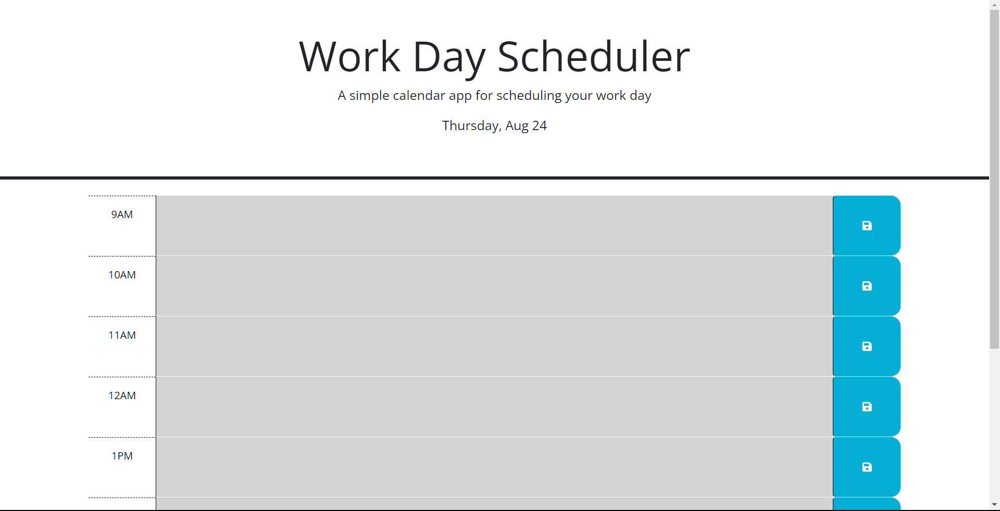

# Workday-Schedule

## Description

### User Story: 
```
AS AN employee with a busy schedule
I WANT to add important events to a daily planner
SO THAT I can manage my time effectively
```
This work Day Scheduler is used to be able to put in notes and tasks that you want to accomplish through the day while it displays the day and shows weather that task was in the past, present, or future of your current time.

## Installations
N/A

## Usage

### Acceptance Criteria:
```
GIVEN I am using a daily planner to create a schedule
WHEN I open the planner
THEN the current day is displayed at the top of the calendar
WHEN I scroll down
THEN I am presented with time blocks for standard business hours of 9am to 5pm
WHEN I view the time blocks for that day
THEN each time block is color-coded to indicate whether it is in the past, present, or future
WHEN I click into a time block
THEN I can enter an event
WHEN I click the save button for that time block
THEN the text for that event is saved in local storage
WHEN I refresh the page
THEN the saved events persist
```
This Work Day Scheduler is here to show the usage of Day.js and jquery. It is used as both an application to help with day timing but also help understand the usage of third party api's.

## Link

## Screenshots
